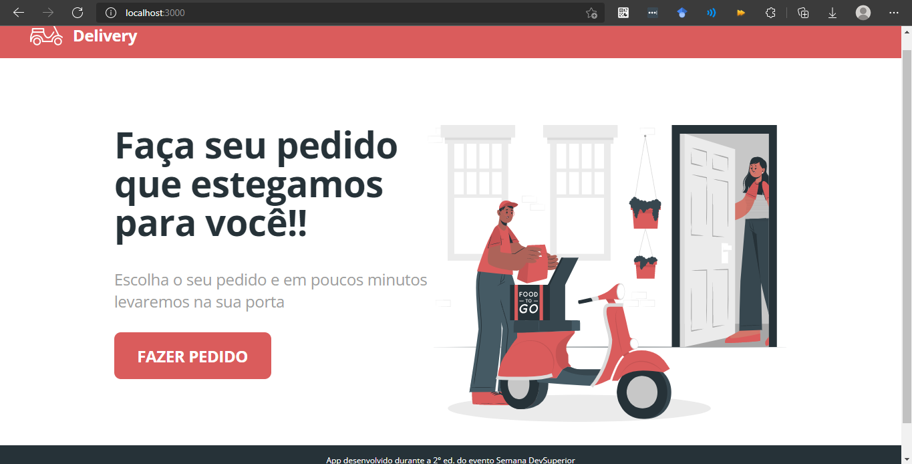
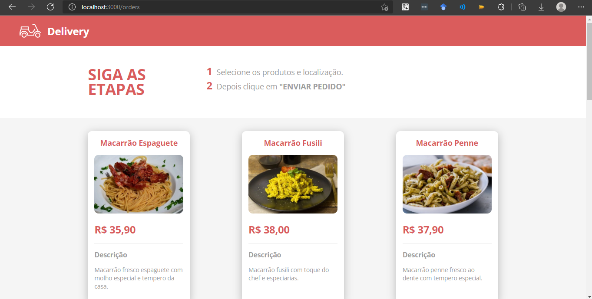
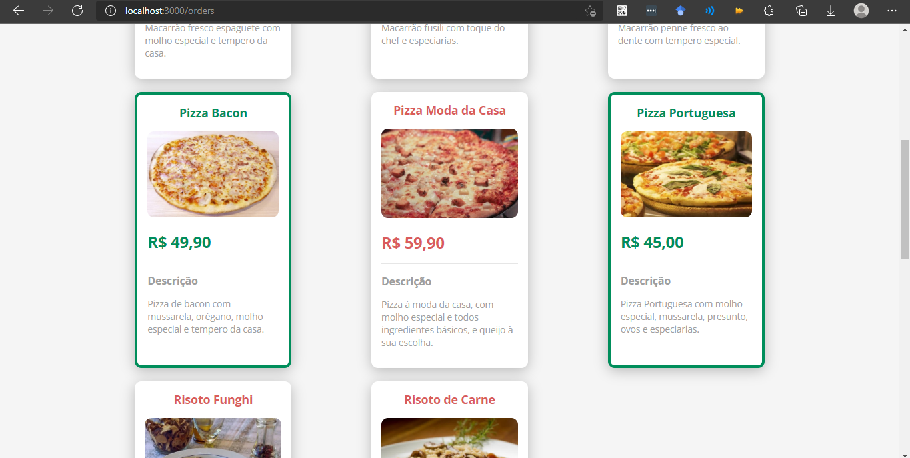
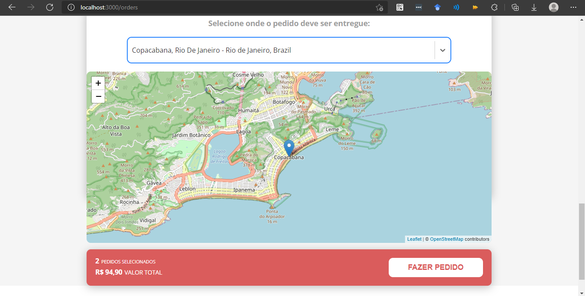

# Sistema de Delivery

## Sobre o projeto
O sistema back-end permite o usuário realizar pedidos de produtos. A arquitetura está dividida nas camadas resource (controller), service e reposotory. 

O front-end é composto por duas telas, a inicial e a que lista os produtos disponíveis. Nesta tela, o usuário pode indicar o endereço de entrega, além de ser informado sobre o valor total da sua compra.

## Tecnologias utilizadas
* Back-end: Java
* Front-end: React
* Spring Boot
* Spring Rest
* Spring Data JPA
* Spring Security
* Banco de Dados H2
* MySql

## Telas do sistema

Ao selecionar um produto, o card tem a sua cor alterada e a quantidade é contabilizada.

O usuário pode digitar no campo o endereço de entrega e o mapa é atualizado automaticamente. Abaixo do mapa é possível visualizar o valor total do pedido e o botão de confirmação.

## Autor
Raul Santos Gonçalves

[https://www.linkedin.com/in/raul-gonçalves-641310190/](https://www.linkedin.com/in/raul-gonçalves-641310190/)
